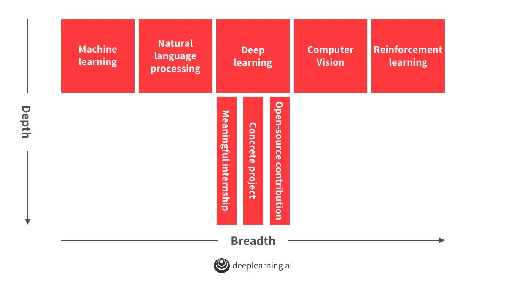

## Advices for Navigating a Career in Machine Learning

1. **What do recruiters look for**: `T-shaped` knowledge base

2. **To build the horizontal piece**:

   [Courses](https://github.com/kmario23/deep-learning-drizzle) and [Papers](./advices-for-paper-reading.md)

3. **To build the vertical piece**:

   Related projects, open-source contributions, research and internships

4. **How to select a job**:

   + **Whether you are working with great people/projects:** being surrounded by hard-working people will influence you.
   + **Focus on knowing about and evaluating the team that you will be working with (the 10–30 people that you will interact with the most) in addition to the manager.**
   + **Do not focus on “brand”:** the brand of the company is not that much correlated to what your personal experience would be like. (⭐️But from my point of view currently, brand is important, because it can beautify my resume)

5. **General Advice**:

   + **Learn the most:** tend to choose things to work on that allow you to learn the most.
   + **Do important work:** work on worthy projects that moves the world forward.
   + **Try to take machine learning to traditional industries:** we’ve transformed a lot in the tech industry but I think one of the most exciting work to be done may be in traditional industries (outside the tech industry) because you can create much more value there.